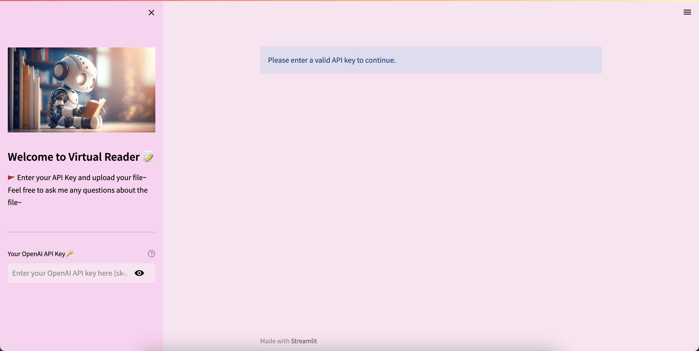
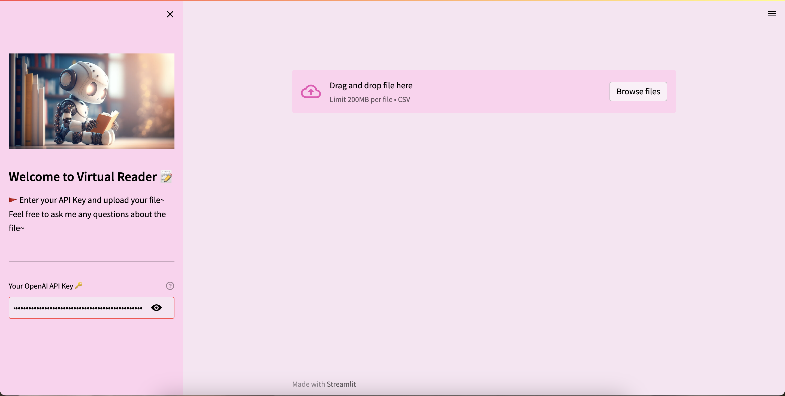

# Chatbot 🤖

Welcome to my File Q&A Chatbot~

## Description 📒

This interactive Chatbot project integrates several advanced technologies to deliver efficient and accurate query responses based on CSV file data. The user interface is developed with Streamlit, ensuring an intuitive and seamless user experience. The core of the Chatbot utilizes OpenAI's GPT-3.5-turbo for natural language processing, enabling it to understand and process complex queries. For document retrieval, we use LangChain, which ensures that the most relevant information is sourced quickly. FAISS is employed for efficient vector storage, facilitating rapid access to data. This combination of technologies ensures that our Chatbot is both powerful and versatile, making it an ideal tool for various data-driven applications.

## Installing 🚀

- Clone the repository:
  ```bash
   git clone https://github.com/EchoEvelyn/Chatbot.git
- Navigate to the project directory:
  ```bash
  cd Chatbot
- Create a virtual environment:
  ```bash
  python -m venv .venv
  .\.venv\Scripts\activate
- Install the required dependencies in the virtual environment

That's it! You can run the code locally~ 🥳

## Demo



